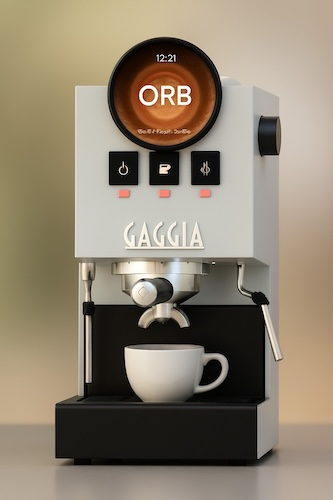

# 🇫🇷 Orb - _Made In France Gaggia mod_ 🇫🇷

> Design-first, fully connected, all-TypeScript Gaggia mod. Bigger round screen, web dev-friendly stack ❤️.
---

## ❓Why
I love coffee, coding, and electronics. I’m building this project from scratch because it’s fun. If you’re a web 
developer, you’ll feel right at home. I’m especially focused on a design with a large round touch display.

# 🛒 Shopping list
> 💡 For a better price, buy everything on Aliexpress (1-2 weeks delivery), I use Amazon for faster delivery (1-day delivery).

> ⚠️ Be careful aliexpress link do not point to the exact same product, check the picture and description before buying.

##### Computer & Touchscreen
- [Kit Raspberry Pi Zero 2W](https://fr.aliexpress.com/item/1005007899652009.html?spm=a2g0o.productlist.main.10.6cc5570J570JX9&aem_p4p_detail=2025092610235611773883144957920002299780&algo_pvid=6927ea4d-6050-4161-8d00-4e5dd35b97e4&algo_exp_id=6927ea4d-6050-4161-8d00-4e5dd35b97e4-9&pdp_ext_f=%7B%22order%22%3A%2238%22%2C%22eval%22%3A%221%22%2C%22fromPage%22%3A%22search%22%7D&pdp_npi=6%40dis%21EUR%2125.65%2125.39%21%21%21208.71%21206.59%21%40211b61d017589074368726435ebac4%2112000044521648395%21sea%21FR%212029245463%21X%211%210%21n_tag%3A-29913%3Bd%3Abd2c1abb%3Bm03_new_user%3A-29895&curPageLogUid=F7ihlSfiwlx7&utparam-url=scene%3Asearch%7Cquery_from%3A%7Cx_object_id%3A1005007899652009%7C_p_origin_prod%3A&search_p4p_id=2025092610235611773883144957920002299780_5) - **40€**
- [Touch Screen 5 inch 1080x1080](https://fr.aliexpress.com/item/1005005498872449.html?spm=a2g0o.order_list.order_list_main.30.58785e5bD7hSzg&gatewayAdapt=glo2fra) - **126€**

> ⚠️ Take with soldered GPIO pins, otherwise you will need to solder them yourself. Your kit should contain at least:
> - Raspberry Pi Zero 2W
> - microSD card (32GB or more) with A2 speed class
> - Power supply (5V 2A) with USB-C connector
> - microSD card reader (if you don't have one)
> - mini HDMI to HDMI adapter (if you don't have one)

##### Accessories
-  [x2 USB-C Cables](https://www.amazon.fr/dp/B0CJNB2MQ7?ref=ppx_yo2ov_dt_b_fed_asin_title) - **14€**
-  [Dupont cables (female-male)](https://www.amazon.fr/dp/B07K8PVKBP?ref_=ppx_printOD_title_dt_b_fed_asin_title_0_1) - **4€**
-  [Dupont cables (female-female)](https://fr.aliexpress.com/item/1005005501503609.html?spm=a2g0o.order_list.order_list_main.25.58785e5bD7hSzg&gatewayAdapt=glo2fra) - **1€**
-  **Not mandatory but useful** - [Raspberry extension cable kit ](https://www.amazon.fr/dp/B072XBX3XX?ref=ppx_yo2ov_dt_b_fed_asin_title) - **13€**

##### Boiler
-  [K-Type M4 Thermocouple](https://fr.aliexpress.com/item/1005005496786289.html?spm=a2g0o.order_list.order_list_main.15.58785e5bD7hSzg&gatewayAdapt=glo2fra) - **2€**
-  [MAX31855 Temperature sensor board](https://fr.aliexpress.com/item/1005005008373588.html?businessType=ProductDetail&srcSns=sns_Copy&spreadType=socialShare&bizType=ProductDetail&social_params=60912297260&aff_fcid=95a1e04e32ac448ea27c9f69c721219f-1757278656595-05401-_EuEbJO4&tt=CPS_NORMAL&aff_fsk=_EuEbJO4&aff_platform=shareComponent-detail&sk=_EuEbJO4&aff_trace_key=95a1e04e32ac448ea27c9f69c721219f-1757278656595-05401-_EuEbJO4&shareId=60912297260&businessType=ProductDetail&platform=AE&terminal_id=4f4c5c4072c3433a89a03e4f7aaeeab8&gatewayAdapt=glo2fra) - **5€**

##### Pump
-  [2-Channel 5V Relay](https://fr.aliexpress.com/item/1005001903120199.html?spm=a2g0o.order_list.order_list_main.20.58785e5bD7hSzg&gatewayAdapt=glo2fra) - **2€**


## 🗺️ Roadmap
> 💡 If you want to vote or suggest new idea go to [Github Discussions](https://github.com/moifort/orb/discussions/categories/ideas)
> 
- ⏳ **Phase 1:** Proof of Concept — ability to control at least one sensor, one relay, and a touchscreen
    - ✅ Initialize NuxtJs project
    - ✅ Buy components
    - ✅ Install on Raspberry Pi Zero in Chromium Kiosk Mode
    - ✅ Connect the touchscreen
    - ✅ Connect a temperature sensor to the Raspberry Pi and display the value on screen
    - Connect a relay to the Raspberry Pi and control it from the screen
- **Phase 2.1:** Purchase the rest of accessories
- **Phase 2.2:** Purchase the Gaggia, add at least one sensor inside the machine
- **Phase 3:** Implement temperature control + manual settings + design the UI
- **Phase 4:** Implement pressure control + manual settings + design the UI
- **Phase 5:** Implement Start/Stop coffee based on action and time + manual settings + design the UI
- **Phase 6:** Implement one profile + design the UI
- **Phase 7:** 3D-print the enclosure + design the UI
- **Phase 8:** Offer a selection of profiles
- **To infinity, and beyond!** see all ideas, vote, and suggest new ones on [Github Discussions](https://github.com/moifort/orb/discussions/categories/ideas)


## Software 
### Requirements
- [Node](https://nodejs.org) 
- [Bun](https://bun.sh/)
- sshpass (only if you want to deploy on raspberry pi with `bun run deploy` command)

###  Setup

```bash
$ bun installation
$ bun dev # serve with hot reload at localhost:3000  
```

## Hardware
We installed a minimal OS on the Raspberry Pi Zero 2W, and set it up to boot directly into Chromium Kiosk mode.
Setup with DietPi Zero 2W

### requirements
```
apt-get install -y build-essential python3 spi-tools bsdextrautils
```

### Sources:
- [Raspberry Pi Zero 2W pine shema](https://pinout.xyz/pinout/pin21_gpio9/)

### Install DietPi
1. Download the [DietPi image](https://dietpi.com/downloads/images/DietPi_RPi234-ARMv8-Trixie.img.xz)
2. Flash it to your microSD card using [balenaEtcher](https://www.balena.io/etcher/)
3. Setup Wifi for the first connect on the freshly installed SD card
```text
# dietpi.txt


```

## 5" waveshare Screen setup
All information [wiki](https://www.waveshare.com/wiki/5inch_1080x1080_LCD)

```text
# /boot/config.txt
hdmi_group=2
hdmi_mode=87
hdmi_pixel_freq_limit=356000000
hdmi_timings=1080 0 68 32 100 1080 0 12 4 16 0 0 0 60 0 85500000 0
```

### Setup Chromium Kiosk mode
- Wiki: [Kiosk Mode](https://dietpi.com/docs/software/desktop/#chromium)
- On ssh run 
```bash
dietpi-software install 113 # Install Chromium
dietpi-autostart # 11 : Chromium - Dedicated use without desktop
```
- add '--no-memcheck'


## Performance

- 56 secondes build from computer.
kill + restart:
- 55 secondes
- 49 secondes --process-per-site
- 

## 🙇 Thanks
- [@Gaggimate](https://github.com/jniebuhr/gaggimate) for the open source code and all the instruction to mod the Gaggia
- [@gaggiuino](https://github.com/Zer0-bit/gaggiuino) for the old open source and all the community
- [@Lance Hedrick](https://www.youtube.com/@LanceHedrick) for discovering the Gaggimate and the Gaggia modding
