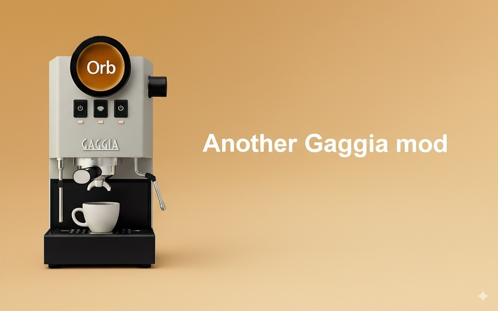

# 🇫🇷 Orb - _Made In France Gaggia mod_ 🇫🇷

> Design-first, fully connected, all-TypeScript Gaggia mod. Bigger round screen, web dev-friendly stack ❤️.
---

## ❓Why
I love coffee, coding, and electronics. I’m building this project from scratch because it’s fun. If you’re a web 
developer, you’ll feel right at home. I’m especially focused on a design with a large round touch display.

## 🗺️ Roadmap
> 💡 If you want to vote or suggest new idea go to [Github Discussions](https://github.com/moifort/orb/discussions/categories/ideas)
 
- ⏳ **Phase 1:** Proof of Concept — ability to control at least one sensor, one relay, and a touchscreen
    - ✅ Initialize NuxtJs project
    - ✅ Buy components
    - ✅ Install on Raspberry Pi Zero in Chromium Kiosk Mode
    - ✅ Connect the touchscreen
    - ✅ Connect a temperature sensor to the Raspberry Pi and display the value on screen
    - Connect a relay to the Raspberry Pi and control it from the screen
- **Phase 2.1:** Purchase the rest of accessories
- **Phase 2.2:** Purchase the Gaggia, add at least one sensor inside the machine
- **Phase 3:** Implement temperature control + manual settings + design the UI
- **Phase 4:** Implement pressure control + manual settings + design the UI
- **Phase 5:** Implement Start/Stop coffee based on action and time + manual settings + design the UI
- **Phase 6:** Implement one profile + design the UI
- **Phase 7:** 3D-print the enclosure + design the UI
- **Phase 8:** Offer a selection of profiles
- **To infinity, and beyond!** see all ideas, vote, and suggest new ones on [Github Discussions](https://github.com/moifort/orb/discussions/categories/ideas)

## 🙇 Thanks
- [@Gaggimate](https://github.com/jniebuhr/gaggimate) for the open source code and all the instruction to mod the Gaggia
- [@gaggiuino](https://github.com/Zer0-bit/gaggiuino) for the old open source and all the community
- [@Lance Hedrick](https://www.youtube.com/@LanceHedrick) for discovering the Gaggimate and the Gaggia modding
